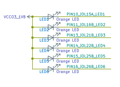
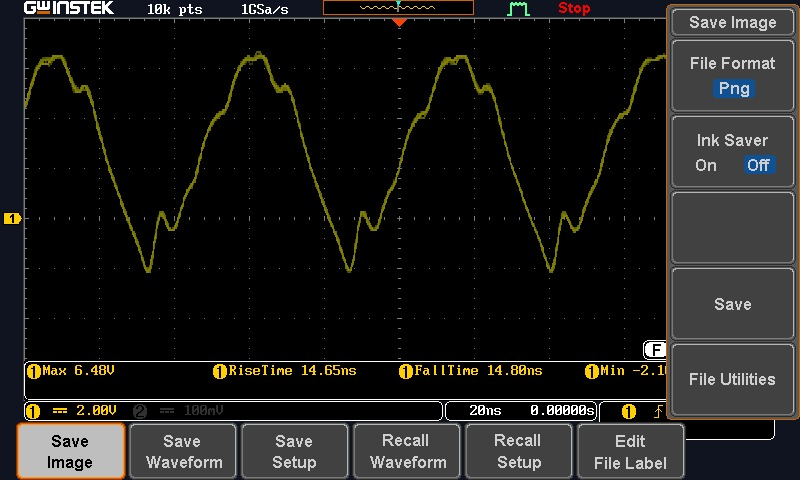
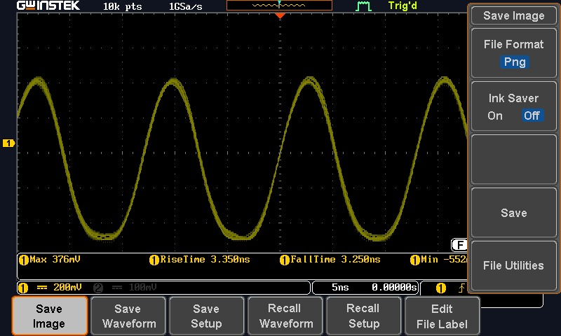

# Hamming74

## 1. Abreviaturas y definiciones
- **FPGA**: Field Programmable Gate Arrays

## 2. Referencias
- [0] David Harris y Sarah Harris. *Digital Design and Computer Architecture. RISC-V Edition.* Morgan Kaufmann, 2022. ISBN: 978-0-12-820064-3

- [1] M. M. Mano and M. D. Ciletti, Digital Design: With an Introduction to the Verilog HDL, VHDL, and SystemVerilog, 5th ed. Boston, MA, USA: Pearson, 2013.

- [2] B. Razavi, Design of Analog CMOS Integrated Circuits, 2nd ed. New York, NY, USA: McGraw-Hill Education, 2016.

## 3. Desarrollo
 - Joan Franco Sandoval 
 - Diego Navarro


### 3.0 Descripción general del sistema

El sistema desarrollado consiste en la implementación de un código de Hamming (7,4) utilizando la placa FPGA Tang Nano 9K. Se reciben dos señales de entrada a través de interruptores DIP (Deep Switch). La primera señal es un arreglo de 4 bits que se utiliza para generar el código de Hamming, el cual servirá como referencia para la segunda entrada. Esta segunda entrada es un arreglo de 7 bits que puede contener un error intencional, con el propósito de ser corregido mediante la verificación de paridad de bits.

Una vez identificado el error inducido, se despliega la información correspondiente tanto en el arreglo de LEDs de la FPGA como en un display de siete segmentos. Esta pantalla está controlada mediante transistores BJT y muestra no solo la posición del error detectado en la entrada del segundo interruptor DIP, sino también

### 3.1 Módulo 1

#### 1. Encabezado del módulo
```SystemVerilog
module top (
    input  [3:0] in,              // 4 bits de datos originales
    input  [6:0] dataRaw,         // Código Hamming con error manual (7 switches)
    input        selector,        // 0 = usar encoder | 1 = usar switches con error
    output [6:0] led,             // Muestra los 7 bits corregidos
    output [6:0] segments,        // Muestra el dato corregido en hexadecimal (4 bits)
    output [6:0] segments_error   // Muestra el bit donde se detectó el error
);
```
#### 2. Parámetros

El módulo superior recibe tres parámetros principales:

- in:Es un interruptor DIP . Esta señal será enviada al módulo de Hamming para su codificación.

- dataraw: Es una señal de entrada de 7 bits, también proveniente de unInterruptor DIP . Representa una palabra ya codificada con un error inducido intencionalmente, con el propósito de ser corregida por el sistema.

- selector: Permite elegir qué información se mostrará en la pantalla de siete segmentos y qué datos serán enviados a los LED. Según su valor, "0" selecciona la palabra codificada (in) o "1", selecciona la palabra corregida (proveniente de dataraw).


#### 3. Entradas y salidas:

Entradas:
- in: [3:0] (4 bits) - Datos originales.
- dataRaw: [6:0] (7 bits) - Código Hamming con posible error.
- selector: (1 bit) - Control para seleccionar entre el código Hamming generado o el manual.


Salidas:
- led: [6:0] (7 bits) - Datos corregidos mostrados en LEDs.
- segments: [6:0] (7 bits) - Dato corregido en formato hexadecimal.
- segments_error: [6:0] (7 bits) - Bit donde se detectó el error.
#### 4. Criterios de diseño


#### 4.1 Introducción

Este módulo actúa como el control principal del código, donde se integran los demás módulos y se realizan las llamadas necesarias para asignar las variables correspondientes. Aquí se gestionan tanto las entradas como las salidas, asegurando que cada componente funcione de manera coordinada y eficiente.

#### 4.2 Explicación del Código

- 1. Declaración del Módulo
```SystemVerilog

module top (
    input  [3:0] in,
    input  [6:0] dataRaw,
    input        selector,
    output [6:0] led,
    output [6:0] segments,
    output [6:0] segments_error
);
```
- module top: Define el módulo principal llamado top.
- input: Se declaran las entradas del módulo, especificando el tamaño de cada una.
- output: Se declaran las salidas del módulo, también especificando el tamaño.


- 2. Señales Internas
```SystemVerilog

wire [6:0] dataRaw_from_encoder;
wire [6:0] dataRaw_muxed;
wire [2:0] posError;
wire [6:0] dataCorregido;
wire [3:0] dataCorrecta;
wire [3:0] errorDisplay;

```
wire: Se declaran señales internas que se utilizarán para conectar diferentes módulos y almacenar resultados intermedios. Cada señal tiene un tamaño específico que se ajusta a los datos que manejará.

- 3. Instanciación de Módulos
```SystemVerilog

hamming74 encoder (
    .in(in),
    .ou(dataRaw_from_encoder)
);
```

hamming74 encoder: Se instancia un módulo llamado hamming74, que se encarga de codificar los datos. Se conectan las entradas y salidas mediante la notación de asignación de puertos.

- 4. Multiplexor
```SystemVerilog

assign dataRaw_muxed = selector ? dataRaw : dataRaw_from_encoder;
```

assign: Se utiliza para asignar valores a las señales. En este caso, se utiliza un operador ternario para seleccionar entre dos fuentes de datos basándose en el valor de selector.


- 5. Detección de Errores
```SystemVerilog

hamming_detection detector (
    .dataRaw(dataRaw_muxed),
    .posError(posError)
);
```

hamming_detection detector: Se instancia un módulo que se encarga de detectar errores en el código Hamming. Se conectan las señales de entrada y salida.

- 6. Corrección de Errores
```SystemVerilog

correccion_error corrector (
    .dataRaw(dataRaw_muxed),
    .sindrome(posError),
    .correccion(dataCorregido),
    .dataCorrecta(dataCorrecta)
);
```

correccion_error corrector: Se instancia un módulo que corrige el error detectado. Se conectan las señales necesarias para la corrección y la extracción de datos.

- 7. Visualización en LED
```SystemVerilog

display_7bits_leds display (
    .coregido(dataCorregido),
    .led(led)
);
```
display_7bits_leds display: Se instancia un módulo que se encarga de mostrar los datos corregidos en un conjunto de LEDs. Se conectan las señales de entrada y salida.

- 8. Visualización en 7 Segmentos
```SystemVerilog

sevseg display_hex(
    .bcd(dataCorrecta),
    .segments(segments)
);
```


sevseg display_hex: Se instancia un módulo que convierte los datos en formato BCD a un formato adecuado para un display de 7 segmentos. Se conectan las señales correspondientes.

- 9. Conversión de Posición de Error
```SystemVerilog
assign errorDisplay = (posError == 3'b000) ? 4'd0 : {1'b0, posError};
```

assign: Se utiliza nuevamente para asignar un valor a errorDisplay, que se utiliza para mostrar la posición del error en un formato adecuado.

- 10. Visualización del Error
```SystemVerilog

sevseg display_error(
    .bcd(errorDisplay),
    .segments(segments_error)
);
```
sevseg display_error: Se instancia otro módulo de visualización que muestra la posición del error en un display de 7 segmentos.


#### 5. Testbench

Se define el valor que va a tener selector. Se genera digitalmente la señal recibida, ya sea "in" o "dataRaw" se evalúan los resultados

=== Pruebas top ===
```SystemVerilog
        $display("Caso | selector | in (ref) | dataRaw (error) | Corrected (7-bit) | 7seg (hex)");
        
        // Caso 1: Modo encoder (selector = 0)
        selector = 0;
        in = 4'b1010;
        dataRaw = 7'b0000000; 
        #10;
        $display("  1   |   %b    |   %b   |    %b    |      %b      |  %b", 
                  selector, in, dataRaw, led, segments);
        
        // Caso 2: Modo error (selector = 1)
        selector = 1;
        in = 4'b1010;
        dataRaw = 7'b1000101;
        #10;
        $display("  2   |   %b    |   %b   |    %b    |      %b      |  %b", 
                  selector, in, dataRaw, led, segments);

        // Caso 3: Otro valor en modo error
        selector = 1;
        in = 4'b0110;
        dataRaw = 7'b0110010;
        #10;
        $display("  3   |   %b    |   %b   |    %b    |      %b      |  %b", 
                  selector, in, dataRaw, led, segments);
```
Resultados obtenidos al ejecutar el make test

- ========================== Pruebas del modulo top ================================
- Caso | selector | in (ref) | dataRaw (error) | Corrected (7-bit) | 7seg (hex)
-   1   |   0    |   1010   |    0000000    |      0101101      |  0001000
-   2   |   1    |   1010   |    1000101    |      0101010      |  0000011
-   3   |   1    |   0110   |    0110010    |      1001100      |  0000010

### 3.2 Módulo 2

#### 1. Encabezado del módulo
```SystemVerilog
- module hamming74 (
  input logic [3:0] in,
  output logic [6:0] ou
);
```
#### 2. Parámetros

El parámetro principal es 'in', que proviene del Deep Switch y transmite cuatro bits de información al módulo para ser codificados según su paridad.

#### 3. Entradas y salidas
- Entradas:
in: Un vector de 4 bits que representa los datos de entrada. Se espera que los bits de entrada sean in[3], in[2], in[1], y in[0].

- Salidas:
ou: Un vector de 7 bits que representa la salida codificada.
#### 4. Criterios de diseño


#### 4.1 Introducción
El código de Hamming (7,4) es un método de corrección de errores que permite la transmisión de datos de manera más confiable. Este código agrega bits de paridad a los datos originales para que, en caso de que se produzca un error durante la transmisión, se pueda detectar y corregir el error. En este módulo, se implementa la lógica necesaria para calcular los bits de paridad y organizar los bits de salida.

#### 4.2 Explicación del Código
El código se implementa en Verilog y se compone de un módulo llamado hamming74. A continuación se detalla la lógica del código:

1. Declaración del Módulo
```SystemVerilog
module hamming74 (
  input [3:0] in,
  output reg [6:0] ou
);
```
- module hamming74: Define el módulo llamado hamming74.
- input [3:0] in: Declara una entrada de 4 bits que representa los datos originales que se desean codificar.
- output reg [6:0] ou: Declara una salida de 7 bits que contendrá el código Hamming generado. Se utiliza reg porque la salida se asigna dentro de un bloque always.

- 2. Declaración de Registros Internos
```SystemVerilog

reg d3, d5, d6, d7;
reg p1, p2, p4;
```
- reg: Se declaran registros internos que se utilizarán para almacenar los bits de datos y paridad.
- d3, d5, d6, d7: Representan los bits de datos originales.
- p1, p2, p4: Representan los bits de paridad que se calcularán a partir de los bits de datos.

- 3. Bloque Always
```SystemVerilog

always @(*) begin
```
always @(*): Este bloque se ejecuta cada vez que hay un cambio en las señales de entrada. El uso de (*) indica que el bloque es sensible a todos los cambios en las señales de entrada.

- 4. Asignación de Bits de Datos
```SystemVerilog

d7 = in[3];
d6 = in[2];
d5 = in[1];
d3 = in[0];
```

Aquí se asignan los bits de entrada a los registros internos. Cada bit de in se asigna a un registro correspondiente (d3, d5, d6, d7).

- 5. Cálculo de Bits de Paridad


```SystemVerilog

p1 = d3 ^ d5 ^ d7;
p2 = d3 ^ d6 ^ d7;
p4 = d5 ^ d6 ^ d7;
```
- XOR (^): Se utilizan operaciones XOR para calcular los bits de paridad:
- p1: Paridad para el primer bit de paridad, que cubre los bits d3, d5 y d7.
- p2: Paridad para el segundo bit de paridad, que cubre los bits d3, d6 y d7.
- p4: Paridad para el cuarto bit de paridad, que cubre los bits d5, d6 y d7.


- 6. Asignación de la Salida
```SystemVerilog


ou[6] = d7;
ou[5] = d6;
ou[4] = d5;
ou[3] = p4;
ou[2] = d3;
ou[1] = p2;
ou[0] = p1;
```

Aquí se asignan los bits de datos y paridad a la salida ou. La salida se organiza de la siguiente manera:
- ou[6]: Bit de datos d7.
- ou[5]: Bit de datos d6.
- ou[4]: Bit de datos d5.
- ou[3]: Bit de paridad p4.
- ou[2]: Bit de datos d3.
- ou[1]: Bit de paridad p2.
- ou[0]: Bit de paridad p1.


#### 5. Testbench
Se define los inputs de entrada y se evalúan los resultados
```SystemVerilog

in_enc = 4'b1010;
#1;
$display("hamming74: in=%b => out=%b", in_enc, out_enc);
in_enc = 4'b1111;
#1;
$display("hamming74: in=%b => out=%b", in_enc, out_enc);
in_enc = 4'b0000;
#1;
$display("hamming74: in=%b => out=%b", in_enc, out_enc);
```
Resultados obtenidos al ejecutar el make test

- hamming74: in=1010 => out=1010010
- hamming74: in=1111 => out=1111111
- hamming74: in=0000 => out=0000000


### 3.3 Módulo 3

#### 1. Encabezado del módulo

```SystemVerilog
module hamming_detection (
  input [6:0] dataRaw,
  output reg [2:0] posError
);
```

#### 2. Parámetros

El parámetro recibido en este módulo es 'dataRaw', que se encarga de transmitir una palabra de 7 bits con un error inducido, permitiendo su detección y posterior corrección

#### 3. Entradas y salidas
Entradas:
- dataRaw: Un vector de 7 bits que representa los datos codificados que se han recibido. Este vector puede contener errores que deben ser detectados.
Salidas:
- posError: Un vector de 3 bits que indica la posición del error detectado. Si no se detecta ningún error, el valor de posError será 000.
#### 4. Criterios de diseño

#### 4.1 Introducción

Gracias al uso de la paridad en los bits, el código de Hamming permite detectar errores al calcular la paridad de un arreglo de bits. En este proceso, cada bit de paridad se encarga de verificar tres bits de información.

#### 4.2 Explicación del Código


1. Declaración del Módulo
```SystemVerilog


module hamming_detection (
  input [6:0] dataRaw,
  output reg [2:0] posError
);
```
module hamming_detection: Define el módulo llamado hamming_detection.
input [6:0] dataRaw: Declara una entrada de 7 bits que representa el código Hamming que se va a verificar en busca de errores.
output reg [2:0] posError: Declara una salida de 3 bits que indicará la posición del error detectado. Se utiliza reg porque la salida se asigna dentro de un bloque always.

2. Cálculo de la Posición del Error
```SystemVerilog


posError[0] = dataRaw[0] ^ dataRaw[2] ^ dataRaw[4] ^ dataRaw[6];
posError[1] = dataRaw[1] ^ dataRaw[2] ^ dataRaw[5] ^ dataRaw[6];
posError[2] = dataRaw[3] ^ dataRaw[4] ^ dataRaw[5] ^ dataRaw[6];
```

- XOR (^): Se utilizan operaciones XOR para calcular los bits de paridad que se utilizan para determinar la posición del error:
- posError[0]: Se calcula utilizando los bits dataRaw[0], dataRaw[2], dataRaw[4] y dataRaw[6]. Este bit indica si hay un error en los bits que cubre.
- posError[1]: Se calcula utilizando los bits dataRaw[1], dataRaw[2], dataRaw[5] y dataRaw[6]. 
- posError[2]: Se calcula utilizando los bits dataRaw[3], dataRaw[4], dataRaw[5] y dataRaw[6]. 


#### 5. Testbench

Descripción y resultados de las pruebas hechas

Errores inducidos en orden:
- Priemra prueba error en el bit 5
- Segunda prueba error en el bit 1
- Tersera pueba prueba error en el bit 1


```SystemVerilog
  data_det = 7'b1000101;  
  #1;
  $display("hamming_detection: dataRaw=%b => posError=%b", data_det, pos_error);
  data_det = 7'b0000001;  
  #1;
  $display("hamming_detection: dataRaw=%b => posError=%b", data_det, pos_error);
  data_det = 7'b0111111;  
  #1;
  $display("hamming_detection: dataRaw=%b => posError=%b", data_det, pos_error);
```
Resultados obtenidos al ejecutar el make test

- hamming_detection: dataRaw=1000101 => posError=101
- hamming_detection: dataRaw=0000001 => posError=001
- hamming_detection: dataRaw=0111111 => posError=111


### 3.4 Módulo 4

#### 1. Encabezado del módulo
```SystemVerilog
- module correccion_error(
  input  logic [6:0] dataRaw,
  input  logic [2:0] sindrome,
  output logic [6:0] correccion,
  output logic [3:0] dataCorrecta
);
```
#### 2. Parámetros
El módulo ``` correccion_error ```  recibe la señal dataRaw , que proviene directamente del Dip Switch tras haber pasado por el módulo hamming_detection. Este sistema cuenta con parámetros configurables, lo que permite ajustar su comportamiento según las necesidades del usuario.


#### 3. Entradas y salidas

- Entradas:
dataRaw: Un vector de 7 bits que representa los datos codificados que se han recibido, que pueden contener errores.
sindrome: Un vector de 3 bits que indica la posición del error detectado. Si no se detecta ningún error, el valor de sindrome será 000.


- Salidas:
correccion: Un vector de 7 bits que representa los datos corregidos. Este vector es una copia de dataRaw, pero con el bit erróneo corregido si se detectó un error.
dataCorrecta: Un vector de 4 bits que representa los datos originales extraídos de los datos corregidos.

#### 4. Criterios de diseño

#### 4.1 Introducción

El código de Hamming no solo permite la detección de errores, sino que también permite la corrección de un solo error en los datos transmitidos. Este módulo se encarga de corregir el error en los datos recibidos utilizando el síndrome, que indica la posición del bit erróneo.

#### 4.2 Explicación del Código

- 1. Declaración del Módulo
```SystemVerilog


module correccion_error(
  input  [6:0] dataRaw,
  input  [2:0] sindrome,
  output reg [6:0] correccion,
  output reg [3:0] dataCorrecta
);
```

module correccion_error: Define el módulo llamado correccion_error.
input [6:0] dataRaw: Declara una entrada de 7 bits que representa el código Hamming que puede contener un error.
input [2:0] sindrome: Declara una entrada de 3 bits que representa el síndrome, que indica la posición del error detectado.
output reg [6:0] correccion: Declara una salida de 7 bits que contendrá el código Hamming corregido. Se utiliza reg porque la salida se asigna dentro de un bloque always.
output reg [3:0] dataCorrecta: Declara una salida de 4 bits que contendrá los datos originales extraídos del código Hamming corregido.
 
- 2. Inicialización de la Salida de Corrección
```SystemVerilog


correccion = dataRaw;

```
Se inicializa la señal correccion con el valor de dataRaw. Esto significa que, por defecto, la salida corregida será igual a la entrada, a menos que se detecte un error.
- 3. Corrección del Error
```SystemVerilog


if (sindrome != 3'b000) begin
    case (sindrome)
        3'b001: correccion[0] = ~correccion[0]; // Bit 1
        3'b010: correccion[1] = ~correccion[1]; // Bit 2
        3'b011: correccion[2] = ~correccion[2]; 
        3'b100: correccion[3] = ~correccion[3];
        3'b101: correccion[4] = ~correccion[4];
        3'b110: correccion[5] = ~correccion[5];
        3'b111: correccion[6] = ~correccion[6];
        default: /* no action */;
    endcase
end
```

if (sindrome != 3'b000): Se verifica si el síndrome indica que hay un error. Si sindrome es 000, no se realiza ninguna corrección.
case (sindrome): Se utiliza una estructura case para determinar qué bit debe ser corregido según el valor del síndrome.

Cada caso corresponde a un valor de sindrome que indica la posición del bit erróneo. Se utiliza la operación NOT (~) para invertir el bit correspondiente en correccion.
- 4. Extracción de Datos Originales
```SystemVerilog


dataCorrecta[3] = correccion[6];
dataCorrecta[2] = correccion[5];
dataCorrecta[1] = correccion[4];
dataCorrecta[0] = correccion[2];

```
Aquí se extraen los 4 bits de datos originales del código Hamming corregido. Los bits se asignan a dataCorrecta en el orden correspondiente:
- dataCorrecta[3]: Bit de datos original correspondiente al bit 6 del código Hamming corregido.
- dataCorrecta[2]: Bit de datos original correspondiente al bit 5.
- dataCorrecta[1]: Bit de datos original correspondiente al bit 4.
- dataCorrecta[0]: Bit de datos original correspondiente al bit 2.


#### 5. Testbench
Descripción y resultados de las pruebas hechas

```SystemVerilog
data_corr = 7'b1000101;
        sindrome = 3'b101;  
        #1;
        $display("correccion_error: in=%b, sindrome=%b => corregido=%b, dato=%b",
                 data_corr, sindrome, corregido, data_correcta);
        data_corr = 7'b0000001;
        sindrome = 3'b001;  
        #1;
        $display("correccion_error: in=%b, sindrome=%b => corregido=%b, dato=%b",
                 data_corr, sindrome, corregido, data_correcta);
        data_corr = 7'b0111111;
        sindrome = 3'b111; 
        #1;
        $display("correccion_error: in=%b, sindrome=%b => corregido=%b, dato=%b",
                 data_corr, sindrome, corregido, data_correcta);
```
Resultados obtenidos al ejecutar el make test

- correccion_error: in=1000101, sindrome=101 => corregido=1010101, dato=1011
- correccion_error: in=0000001, sindrome=001 => corregido=0000000, dato=0000
- correccion_error: in=0111111, sindrome=111 => corregido=1111111, dato=1111


### 3.5 Módulo 5

#### 1. Encabezado del módulo
```SystemVerilog
- module display_7bits_leds (
  input  logic [6:0] coregido,
    output logic [6:0] led
);
```
#### 2. Parámetros

Este módulo no utiliza parámetros configurables, ya que se trata de una implementación fija de inversión de bits.

#### 3. Entradas y salidas:

Entradas:

- coregido (7 bits): Representa la señal de entrada que se desea visualizar en los LEDs.

Salidas:

- led (7 bits): Representa la salida invertida de la entrada coregido, que se conecta a un conjunto de LEDs.


#### 4. Criterios de diseño

#### 4.1 Introducción

- El diseño de este módulo sigue una arquitectura combinacional sencilla, donde la salida se calcula en función de la entrada sin necesidad de registros o almacenamiento temporal. Esto significa que los cambios en la entrada se reflejan inmediatamente en la salida.

#### 4.2 Explicación del Código

- 1. Declaración del Módulo
```SystemVerilog


module display_7bits_leds (
    input [6:0] coregido,
    output reg [6:0] led
);
```
module display_7bits_leds: Define el módulo llamado display_7bits_leds.
input [6:0] coregido: Declara una entrada de 7 bits que representa el código Hamming corregido que se desea mostrar en los LEDs.
output reg [6:0] led: Declara una salida de 7 bits que representará el estado de los LEDs. Se utiliza reg porque la salida se asigna dentro de un bloque always.

- 2. Asignación de los LEDs
```SystemVerilog


led[0] = ~coregido[0];
led[1] = ~coregido[1];
led[2] = ~coregido[2];
led[3] = ~coregido[3];
led[4] = ~coregido[4];
led[5] = ~coregido[5];
led[6] = ~coregido[6];
```
Aquí se asignan los valores de coregido a los LEDs. Cada bit de coregido se invierte (usando la operación NOT ~) antes de ser asignado a la salida led. Esto se hace porque, debido a la conexión física de los LEDs dentro de la FPGA, los LEDs son activados en bajo, lo que significa que se encienden cuando la señal es baja (0) y se apagan cuando la señal es alta (1).




#### 5. Testbench
Descripción y resultados de las pruebas hechas

```SystemVerilog
 coregido_leds = 7'b1010101;
        #1;
        $display("display_7bits_leds: in=%b => leds=%b", coregido_leds, leds_out);
        coregido_leds = 7'b1111111;
        #1;
        $display("display_7bits_leds: in=%b => leds=%b", coregido_leds, leds_out);
        coregido_leds = 7'b0000000;
        #1;
        $display("display_7bits_leds: in=%b => leds=%b", coregido_leds, leds_out);
```
Resultados obtenidos al ejecutar el make test
- display_7bits_leds: in=1010101 => leds=0101010
- display_7bits_leds: in=1111111 => leds=0000000
- display_7bits_leds: in=0000000 => leds=1111111


### 3.6 Módulo 6


#### 1. Encabezado del módulo
```SystemVerilog

module sevseg(
    input  [3:0] bcd,       
    output reg [6:0] segments
);
```
#### 2. Parámetros

El módulo no tiene parámetros configurables, pero su funcionamiento se basa en la representación de números en un display de 7 segmentos

#### 3. Entradas y salidas:

- Entradas:
bcd: Un vector de 4 bits que representa un número en formato BCD. Este número puede estar en el rango de 0 a 15, aunque solo los valores de 0 a 9 se utilizan comúnmente para mostrar dígitos.

- Salidas:
segments: Un vector de 7 bits que controla los segmentos del display. Cada bit en este vector representa un segmento del display (a-g), donde un 0 enciende el segmento y un 1 lo apaga.

#### 4. Criterios de diseño

#### 4.1 Introducción

El display de 7 segmentos es un dispositivo que puede mostrar números y algunas letras al encender o apagar sus segmentos. Este módulo convierte un número BCD en la configuración de segmentos necesaria para mostrar el número correspondiente en el display.

#### 4.2 Explicación del Código

- 1. Declaración del Módulo

```SystemVerilog

module sevseg(
    input  [3:0] bcd,    
    output reg [6:0] segments 
);
```

module sevseg: Define el módulo.
input [3:0] bcd: Declara una entrada de 4 bits que representa un número en formato BCD. Este número puede ser del 0 al 15, aunque solo los valores del 0 al 9 se utilizan comúnmente para mostrar dígitos en un display de 7 segmentos.
output reg [6:0] segments: Declara una salida de 7 bits que representa el estado de los segmentos del display (a-g). Se utiliza reg porque la salida se asigna dentro de un bloque always.

3. Conversión de BCD a Segmentos


```SystemVerilog
case (bcd)
    4'b0000: segments = 7'b1000000; // 0
    4'b0001: segments = 7'b1111001; // 1
    4'b0010: segments = 7'b0100100; // 2
    4'b0011: segments = 7'b0110000; // 3
    4'b0100: segments = 7'b0011001; // 4
    4'b0101: segments = 7'b0010010; // 5
    4'b0110: segments = 7'b0000010; // 6
    4'b0111: segments = 7'b1111000; // 7
    4'b1000: segments = 7'b0000000; // 8
    4'b1001: segments = 7'b0010000; // 9
    4'b1010: segments = 7'b0001000; // A
    4'b1011: segments = 7'b0000011; // b
    4'b1100: segments = 7'b1000110; // C
    4'b1101: segments = 7'b0100001; // d
    4'b1110: segments = 7'b0000110; // E
    4'b1111: segments = 7'b0001110; // F
    default: segments = 7'b1100011; // Apagado
endcase
```
case (bcd): Se utiliza una estructura case para determinar qué segmentos del display deben encenderse según el valor de bcd.
Cada caso corresponde a un valor de bcd y asigna un valor de 7 bits a segments, donde cada bit representa un segmento del display de 7 segmentos (a-g).
Por ejemplo, 7'b1000000 enciende el segmento "a" para mostrar el número 0, mientras que 7'b1111001 enciende los segmentos necesarios para mostrar el número 1.
Los valores de bcd de 10 a 15 (A-F) también están mapeados, lo que permite mostrar letras en el display.
default: Si el valor de bcd no coincide con ninguno de los casos anteriores, se asigna un valor que apaga el display (en este caso, 7'b1100011).


#### 5. Testbench
Descripción y resultados de las pruebas hechas

```SystemVerilog
   bcd_val = 4'hA; 
        #1;
        $display("sevseg: bcd=%h => seg=%b", bcd_val, seg_out);
        bcd_val = 4'h0; 
        #1;
        $display("sevseg: bcd=%h => seg=%b", bcd_val, seg_out);
        bcd_val = 4'h2; 
        #1;
        $display("sevseg: bcd=%h => seg=%b", bcd_val, seg_out);
        bcd_val = 4'h9; 
        #1;
        $display("sevseg: bcd=%h => seg=%b", bcd_val, seg_out);
        
```
Resultados obtenidos al ejecutar el make test

- sevseg: bcd=a => seg=0001000
- sevseg: bcd=0 => seg=1000000
- sevseg: bcd=2 => seg=0100100
- sevseg: bcd=9 => seg=0010000


#### 5. Testbench
Descripción y resultados de las pruebas hechas

```SystemVerilog
  bcd_val = 4'hA; 
        #1;
        $display("sevseg: bcd=%h => seg=%b", bcd_val, seg_out);
        bcd_val = 4'h0; 
        #1;
        $display("sevseg: bcd=%h => seg=%b", bcd_val, seg_out);
        bcd_val = 4'h2; 
        #1;
        $display("sevseg: bcd=%h => seg=%b", bcd_val, seg_out);
        bcd_val = 4'h9; 
        #1;
        $display("sevseg: bcd=%h => seg=%b", bcd_val, seg_out);
```
Resultados obtenidos al ejecutar el make test

- sevseg: bcd=a => seg=0001000
- sevseg: bcd=0 => seg=1000000
- sevseg: bcd=2 => seg=0100100
- sevseg: bcd=9 => seg=0010000


## 4. Consumo de recursos
Resumen de Recursos Utilizados

### 4.1 Conexiones (Wires)
- Número total de conexiones: 41
- Número total de bits de conexión: 127
- Conexiones públicas: 41
- Bits de conexiones públicas: 127
### 4.2 Memorias
- Número de memorias: 0
- Bits de memoria: 0
### 4.3  Celdas (Cells)
- Total de celdas: 50
- GND: 1
- IBUF (Buffers de entrada): 12
- LUT1 (Look-Up Tables de 1 entrada): 6
- LUT3: 6
- LUT4: 11
- MUX2_LUT5: 6
- MUX2_LUT6: 1
- OBUF (Buffers de salida): 7
### 4.4  Utilización del Dispositivo
- VCC (Voltaje de alimentación): 1/1 (100%)
- SLICE: 23/8640 (0%)
- IOB (Input/Output Blocks): 19/274 (6%)
- ODDR (Double Data Rate Output): 0/274 (0%)
- MUX2_LUT5: 6/4320 (0%)
- MUX2_LUT6: 1/2160 (0%)
- GND: 1/1 (100%)
- GSR (Global Set/Reset): 1/1 (100%)
- OSC (Oscilador): 0/1 (0%)
- rPLL (Phase-Locked Loop): 0/2 (0%)
- Resultados de la Herramienta BC y ABC
- BC RESULTS:
- Celdas LUT: 16
- ABC RESULTS:
- Señales internas: 51
- Señales de entrada: 12
- Señales de salida: 7
### 4.5 Rendimiento y Tiempos de Retardo
- Max delay: Se reporta un retardo máximo de 23.84 ns, lo que es importante para asegurar que el diseño cumpla con los requisitos de temporización.

## 5. Problemas encontrados durante el proyecto

Durante la realización de este proyecto se presentaron diversos errores que afectarán su desarrollo. Uno de los principales inconvenientes surgió al intentar desplegar información en los LEDs de la FPGA. Debido a una interpretación incorrecta de los planos de conexión de la FPGA. Como resultado, la información se muestra de forma invertida, ya que era necesario negar previamente los valores enviados a los LED.

Otro problema significativo fue la incompatibilidad al implementar ciertas herramientas, particularmente con SystemVerilog, a diferencia de Verilog, lo que impidió realizar la síntesis correctamente mediante Yosys.

También se presentan dificultades con el despliegue de información en los displays de siete segmentos, ya que estos no reciben correctamente los datos enviados desde la FPGA.

La integración de los distintos módulos en el módulo superior generó múltiples complicaciones , tanto a nivel de sintaxis como en la lógica utilizada, lo cual requirió una revisión detallada de cada componente.

Finalmente, uno de los errores más críticos estuvo relacionado con la correcta implementación de las constraints , ya que fue necesario especificar adecuadamente el tipo de entrada y resistencias pull-up o pull-down .


# Oscilador en anillo

## 1. Primera Medición
Para la primera medición realizada el oscilador de anillos se utilizaron cinco compuertas not el resultado de la medición se muestra en la siguiente imagen


- Tención max:3.1 v
- Tencion min:0.231 mv
- Tiempo aproximado de la osilación: 30 ns
- Frecianecia de Ocilación aproximada: 33.3MHz

En la primera medición, se observa la señal generada por un oscilador en anillo basado en un 74LS04. A diferencia de la onda cuadrada ideal, la forma de la señal presenta una ligera curvatura en los flancos, producto de los tiempos de carga y los retardos de propagación propios de la familia TTL. Aun así, los tiempos de subida y bajada, cercanos a 15 ns, se encuentran dentro de los valores típicos para un 74LS04. Además, se aprecian picos por encima y por debajo de los niveles esperados, causados principalmente por la inductancia y capacidad parásitas del circuito, así como por el acoplamiento de la sonda del osciloscopio. En conjunto, estos resultados confirman el comportamiento previsto para un oscilador en anillo con compuertas TTL.

## 2. Segunda Medición

Para la segunda medición se conectaron tres inversores en anillo

.jpeg>)

- Tención max:4.40 v
- Tencion min:-1.2 v
- Tiempo aproximado de la osilación: 75 ns
- Frecianecia de Ocilación aproximada: 13.3MHz


## 3. Tercera Medición

Para la segunda medición realizada se conectaron tres inversores en anillo y se alargó la conexión con un cable de aproximadamente un metro



- Tención max:6.48 v
- Tencion min:-2.1 v
- Tiempo aproximado de la osilación: 55 ns
- Frecianecia de Ocilación aproximada: 18.2MHz

Al introducir un metro de cable calibre 22 entre la salida del último inversor y la entrada del primero, se aprecian variaciones en los tiempos de subida y bajada, así como en el período de oscilación. Esto coincide con el retardo adicional aportado por la longitud del cable y sus elementos parásitos (resistencia, inductancia, etc.), que prolongan el tiempo total de propagación de la señal.


## 4. Cuarta Medición


Finalmente para la última medición se conecta la entrada con la salida de una compuerta 



- Tención max:376 mv
- Tencion min:-552 v
- Tiempo aproximado de la osilación: 10 ns
- Frecianecia de Ocilación aproximada: 100MHz 

Al retroalimentar la salida de la compuerta con su propia entrada, el circuito deja de comportarse como un oscilador puramente digital y se estabiliza cerca de un punto de polarización intermedio. Esto produce una señal de baja amplitud, con forma casi sinusoidal, en lugar de los niveles lógicos típicos de alta y baja


